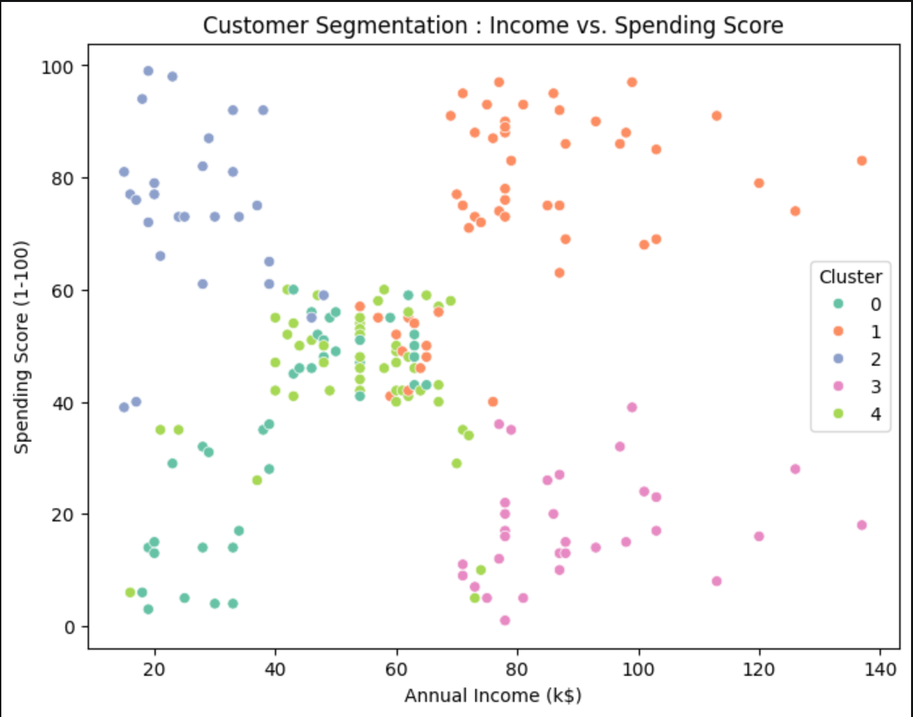

# Customer Segmentation Analysis via Unsupervised Learning

## Overview
This repository contains an end-to-end unsupervised machine learning pipeline designed to identify distinct consumer spending patterns. By analyzing demographic and purchasing data, the model groups mall customers into actionable marketing segments, enabling businesses to optimize their targeting strategies and maximize ROI.

## Methodology
* **Data Preprocessing:** Standardized numeric features to ensure uniform distance metrics.
* **Dimensionality Reduction:** Applied **Principal Component Analysis (PCA)** to reduce the feature space from 3D to 2D while preserving over 77% of the data's variance, allowing for clear visual cluster separation.
* **Clustering:** Implemented **K-Means Clustering**, utilizing the Elbow Method to determine the optimal number of clusters ($k=5$).

## Key Findings & Consumer Personas
Based on the algorithmic grouping, five distinct consumer profiles were identified:

1. **Target Customers (VIPs):** High Income, High Spending. *(Ideal demographic for premium/loyalty marketing).*
2. **Sensible Shoppers:** High Income, Low Spending. *(Target for high-value/practical promotions).*
3. **Careless Spenders:** Low Income, High Spending. 
4. **Standard Customers:** Moderate Income, Moderate Spending.
5. **Budget Customers:** Low Income, Low Spending.

## Visualizing the Clusters


## Repository Structure
```text
├── data/
│   └── Mall_Customers.csv               # Raw demographic and spending dataset
├── img/
│   └── cluster_plot.png                 # Scatter plot mapping Income vs. Spending
├── notebooks/
│   └── 01_kmeans_pca_clustering.ipynb   # Core analysis, EDA, and model training
└── README.md
